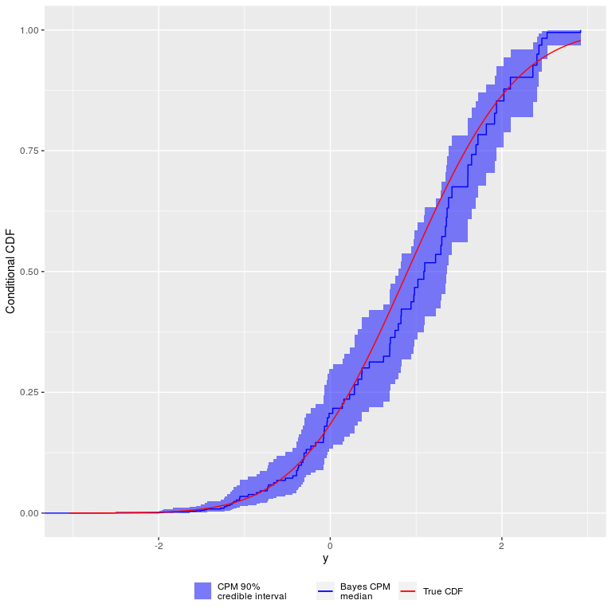

<!-- README.md is generated from README.Rmd. Please edit that file -->

# bayesCPM

<!-- badges: start -->

<!-- badges: end -->

This package includes functions to fit a Bayesian Cumulative Probability
Model (CPM) using the R interface to Stan.

## Installation

<!--
You can install the released version of bayesCPM from [CRAN](https://CRAN.R-project.org) with:

``` r
install.packages("bayesCPM")
```
-->

You can install the development version from
[GitHub](https://github.com/) with:

``` r
# install.packages("devtools")
devtools::install_github("ntjames/bayes_cpm/pkg")
```

## Example

This is a basic example:

``` r
library(bayesCPM)
library(dplyr) # needed for bayesCPM::mkStanDat()
#> 
#> Attaching package: 'dplyr'
#> The following objects are masked from 'package:stats':
#> 
#>     filter, lag
#> The following objects are masked from 'package:base':
#> 
#>     intersect, setdiff, setequal, union

## make example data
set.seed(1567)
n <- 100
x1 <- rnorm(n)
y <- 0.9*x1 + rnorm(n)
dat <- data.frame(y=ordered(y),x1)

## convert data to Stan format (link=2 is probit)
dat_stan  <- mkStanDat(dat, outcome="y", preds = c("x1"), link=2)

## sample from Bayes CPM model with probit link
fit <- bayes_cpm(dat_stan)
#> 
#> SAMPLING FOR MODEL 'bayes_cpm_mod' NOW (CHAIN 1).
#> Chain 1: 
#> Chain 1: Gradient evaluation took 0.000156 seconds
#> Chain 1: 1000 transitions using 10 leapfrog steps per transition would take 1.56 seconds.
#> Chain 1: Adjust your expectations accordingly!
#> Chain 1: 
#> Chain 1: 
#> Chain 1: Iteration:    1 / 2000 [  0%]  (Warmup)
#> Chain 1: Iteration:  200 / 2000 [ 10%]  (Warmup)
#> Chain 1: Iteration:  400 / 2000 [ 20%]  (Warmup)
#> Chain 1: Iteration:  600 / 2000 [ 30%]  (Warmup)
#> Chain 1: Iteration:  800 / 2000 [ 40%]  (Warmup)
#> Chain 1: Iteration: 1000 / 2000 [ 50%]  (Warmup)
#> Chain 1: Iteration: 1001 / 2000 [ 50%]  (Sampling)
#> Chain 1: Iteration: 1200 / 2000 [ 60%]  (Sampling)
#> Chain 1: Iteration: 1400 / 2000 [ 70%]  (Sampling)
#> Chain 1: Iteration: 1600 / 2000 [ 80%]  (Sampling)
#> Chain 1: Iteration: 1800 / 2000 [ 90%]  (Sampling)
#> Chain 1: Iteration: 2000 / 2000 [100%]  (Sampling)
#> Chain 1: 
#> Chain 1:  Elapsed Time: 2.19886 seconds (Warm-up)
#> Chain 1:                1.50175 seconds (Sampling)
#> Chain 1:                3.70061 seconds (Total)
#> Chain 1: 
#> 
#> SAMPLING FOR MODEL 'bayes_cpm_mod' NOW (CHAIN 2).
#> Chain 2: 
#> Chain 2: Gradient evaluation took 9.3e-05 seconds
#> Chain 2: 1000 transitions using 10 leapfrog steps per transition would take 0.93 seconds.
#> Chain 2: Adjust your expectations accordingly!
#> Chain 2: 
#> Chain 2: 
#> Chain 2: Iteration:    1 / 2000 [  0%]  (Warmup)
#> Chain 2: Iteration:  200 / 2000 [ 10%]  (Warmup)
#> Chain 2: Iteration:  400 / 2000 [ 20%]  (Warmup)
#> Chain 2: Iteration:  600 / 2000 [ 30%]  (Warmup)
#> Chain 2: Iteration:  800 / 2000 [ 40%]  (Warmup)
#> Chain 2: Iteration: 1000 / 2000 [ 50%]  (Warmup)
#> Chain 2: Iteration: 1001 / 2000 [ 50%]  (Sampling)
#> Chain 2: Iteration: 1200 / 2000 [ 60%]  (Sampling)
#> Chain 2: Iteration: 1400 / 2000 [ 70%]  (Sampling)
#> Chain 2: Iteration: 1600 / 2000 [ 80%]  (Sampling)
#> Chain 2: Iteration: 1800 / 2000 [ 90%]  (Sampling)
#> Chain 2: Iteration: 2000 / 2000 [100%]  (Sampling)
#> Chain 2: 
#> Chain 2:  Elapsed Time: 2.05041 seconds (Warm-up)
#> Chain 2:                1.49287 seconds (Sampling)
#> Chain 2:                3.54328 seconds (Total)
#> Chain 2: 
#> 
#> SAMPLING FOR MODEL 'bayes_cpm_mod' NOW (CHAIN 3).
#> Chain 3: 
#> Chain 3: Gradient evaluation took 9.1e-05 seconds
#> Chain 3: 1000 transitions using 10 leapfrog steps per transition would take 0.91 seconds.
#> Chain 3: Adjust your expectations accordingly!
#> Chain 3: 
#> Chain 3: 
#> Chain 3: Iteration:    1 / 2000 [  0%]  (Warmup)
#> Chain 3: Iteration:  200 / 2000 [ 10%]  (Warmup)
#> Chain 3: Iteration:  400 / 2000 [ 20%]  (Warmup)
#> Chain 3: Iteration:  600 / 2000 [ 30%]  (Warmup)
#> Chain 3: Iteration:  800 / 2000 [ 40%]  (Warmup)
#> Chain 3: Iteration: 1000 / 2000 [ 50%]  (Warmup)
#> Chain 3: Iteration: 1001 / 2000 [ 50%]  (Sampling)
#> Chain 3: Iteration: 1200 / 2000 [ 60%]  (Sampling)
#> Chain 3: Iteration: 1400 / 2000 [ 70%]  (Sampling)
#> Chain 3: Iteration: 1600 / 2000 [ 80%]  (Sampling)
#> Chain 3: Iteration: 1800 / 2000 [ 90%]  (Sampling)
#> Chain 3: Iteration: 2000 / 2000 [100%]  (Sampling)
#> Chain 3: 
#> Chain 3:  Elapsed Time: 2.06243 seconds (Warm-up)
#> Chain 3:                1.4486 seconds (Sampling)
#> Chain 3:                3.51103 seconds (Total)
#> Chain 3: 
#> 
#> SAMPLING FOR MODEL 'bayes_cpm_mod' NOW (CHAIN 4).
#> Chain 4: 
#> Chain 4: Gradient evaluation took 9.7e-05 seconds
#> Chain 4: 1000 transitions using 10 leapfrog steps per transition would take 0.97 seconds.
#> Chain 4: Adjust your expectations accordingly!
#> Chain 4: 
#> Chain 4: 
#> Chain 4: Iteration:    1 / 2000 [  0%]  (Warmup)
#> Chain 4: Iteration:  200 / 2000 [ 10%]  (Warmup)
#> Chain 4: Iteration:  400 / 2000 [ 20%]  (Warmup)
#> Chain 4: Iteration:  600 / 2000 [ 30%]  (Warmup)
#> Chain 4: Iteration:  800 / 2000 [ 40%]  (Warmup)
#> Chain 4: Iteration: 1000 / 2000 [ 50%]  (Warmup)
#> Chain 4: Iteration: 1001 / 2000 [ 50%]  (Sampling)
#> Chain 4: Iteration: 1200 / 2000 [ 60%]  (Sampling)
#> Chain 4: Iteration: 1400 / 2000 [ 70%]  (Sampling)
#> Chain 4: Iteration: 1600 / 2000 [ 80%]  (Sampling)
#> Chain 4: Iteration: 1800 / 2000 [ 90%]  (Sampling)
#> Chain 4: Iteration: 2000 / 2000 [100%]  (Sampling)
#> Chain 4: 
#> Chain 4:  Elapsed Time: 2.07044 seconds (Warm-up)
#> Chain 4:                1.41738 seconds (Sampling)
#> Chain 4:                3.48783 seconds (Total)
#> Chain 4:
```

Using the model fit we can get a summary of the posterior conditional
mean

``` r
## posterior conditional mean when x=1
fit_mn <- getMean(fit, dat_stan, newdata=data.frame(x1=c(1)))
fit_mn
#> # A tibble: 1 x 13
#>   ndrow mean_mn med_mn sd_mn mn_q2.5 mn_q5 mn_q10 mn_q25 mn_q75 mn_q90 mn_q95
#>   <int>   <dbl>  <dbl> <dbl>   <dbl> <dbl>  <dbl>  <dbl>  <dbl>  <dbl>  <dbl>
#> 1     1   0.972  0.975 0.135   0.703 0.751  0.796  0.880   1.07   1.14   1.19
#> # … with 2 more variables: mn_q97.5 <dbl>, x1 <dbl>
```

or plot the median of the posterior conditional CDF

``` r
## get posterior conditional CDF when x=1
fit_cdf <- getCDF(fit, dat_stan, newdata=data.frame(x1=c(1))) 

plot(fit_cdf$yval, fit_cdf$med_cdf, type="s", xlab="y", ylab="Conditional CDF")
```



<!--
You'll still need to render `README.Rmd` regularly, to keep `README.md` up-to-date.

You can also embed plots, In that case, don't forget to commit and push the resulting figure files, so they display on GitHub!
-->
